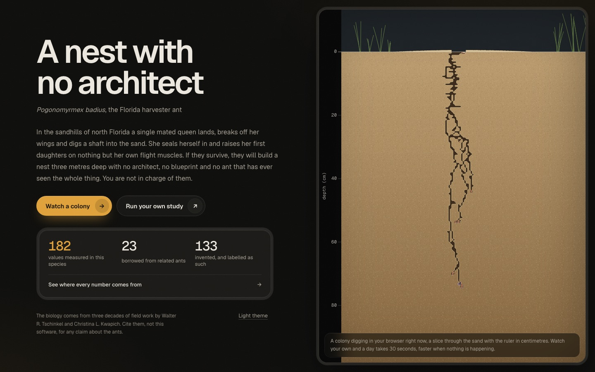
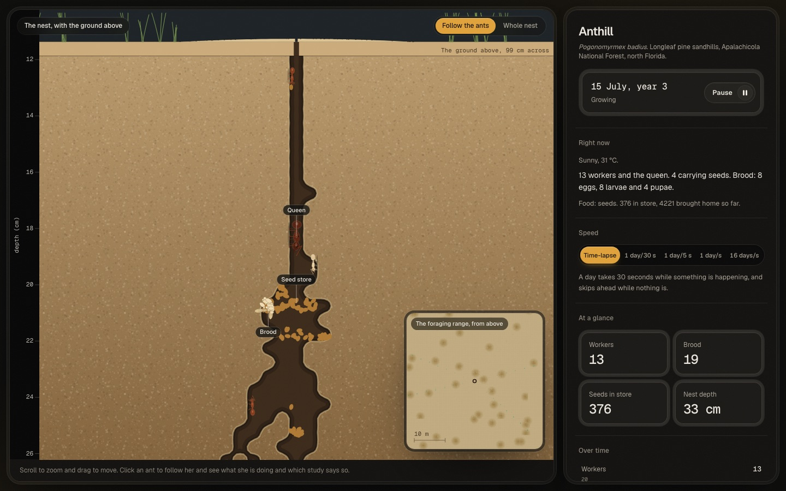

# Anthill

A harvester ant colony built from the published science.

**[Try it live](https://adiezc.github.io/ANThill-Sim/)**, or **[go straight to a colony](https://adiezc.github.io/ANThill-Sim/?watch)**.
It runs in the browser, with nothing to install.

**Status: finished.** Version 1.0.0, September 2026. The project is complete and no longer
maintained, and the repository is archived. It was built by Adrian Diez Cuadrado with Claude Code
as an AI pair programmer, starting from a written build brief that is kept in the git history.
Every design choice, including the ones that were tried and undone, is recorded in
[`docs/DECISIONS.md`](docs/DECISIONS.md).



Anthill simulates one colony of the Florida harvester ant, _Pogonomyrmex badius_, from the day
a mated queen lands to the day the colony dies. She digs a shaft and raises her first
daughters on her own reserves. Her workers dig the nest, forage for seeds, store them, carry
out the dead and move house about once a year. Winged queens and males leave after heavy rain.

No ant holds a map, a plan or any knowledge of the nest as a whole. Every tunnel and chamber on
screen is what individual ants left behind while following local rules, and nobody is in charge
of them, including you.



## Every number says where it came from

Each rule an ant follows, and each value in the model, carries a tag that the simulator shows
when you click an ant.

| Tag     | Meaning                                                               |
| ------- | --------------------------------------------------------------------- |
| **[A]** | Measured in _Pogonomyrmex badius_                                     |
| **[B]** | Borrowed from another ant, because nobody has measured it in _badius_ |
| **[C]** | Invented, and labelled as such                                        |

There is also a list of intuitive ideas the model refuses to adopt, because researchers tested
them in this species and found them wrong: majors are not soldiers, idle workers do not step in
when foragers are lost, and big workers do not fetch big seeds from far away. See
[`docs/SCIENCE.md`](docs/SCIENCE.md) section 11.

## Two ways to use it

**Watch a colony.** One colony in a browser tab. A simulated day takes 30 seconds while
something is happening and skips ahead while nothing is. Click or tap an ant to follow her
and see which study her current rule comes from. When something worth seeing starts, such as
the first worker hatching, a body being carried out, a mating flight or a move of house, a
banner offers to take you there and slows short moments down. A chart in the panel follows
workers, brood and stored seed over the colony's life. On a phone, pinch to zoom.

**Run a study.** Many colonies on your own machine, written out with a methods report. A
browser tab can run one colony well but not thirty, so studies run headless in Node.

## What it does, and where it falls short

**Built.** The founding queen digs to the measured 29 to 37 cm and raises her first brood on her
own reserves. Workers dig chambers under a per-ant digging budget that keeps nest depth close to
Tschinkel's law between worker number and depth. Foragers work trunk trails and bring home seeds
in four measured sizes, which are carried down to the seed chambers, germinate with the soil
temperature and feed the larvae. Each worker's path to foraging is set by the season she was
born in, and never reverses. Weather changes from day to day: foragers stay in during rain and
on the hottest afternoons. Colonies move about once a year along a trunk trail and dig a new
nest, carrying the seed store and then the brood along the trail. Winged queens and males fly on
the morning after heavy rain in early summer. Workers carry the dead out of the nest. About one
year in ten is a drought, and colonies stop growing through it, as they did in 2011. Foragers that
meet a disturbance on the ground raise the alarm and circle it.

**The main shortfall is colony size.** Real colonies start rearing queens and males at about 700
workers and average about 4300 once mature. How much seed lies on the ground in these sandhills
has never been measured, so the model's value is fitted: at it, two colonies in three pass 700
workers by their fifth year. A colony that passes it falls back the year after, one from 1080
workers to 81, starving its larvae with a store of seeds too large to open, where real colonies hold
their size. See [`docs/DECISIONS.md`](docs/DECISIONS.md) D43 and D47.

**Smaller gaps.** Foraging begins in April and rises through spring, but it peaks in July where
real colonies peak in May and June, and March is still about zero. Workers do not sort themselves by depth as cleanly as in real nests.
Recruitment trails bring a colony only 3 to 7 percent more seed. The alarm scent is shorter-lived
and shorter-ranged than one step of the model, so how near a forager must be to respond is a
labelled guess. [`docs/VALIDATION.md`](docs/VALIDATION.md) lists every
acceptance test the model meets and fails, with the numbers.

## Running it

```bash
npm install
npm run dev        # the simulator, in the browser
npm test           # determinism and validation suites
npm run headless   # one seeded run, no renderer, machine-readable output
```

### Running a study

```bash
npm run study -- --replicates 30 --years 12 --out out/my-study
```

This writes four files.

| File            | What it holds                                                                                                                       |
| --------------- | ----------------------------------------------------------------------------------------------------------------------------------- |
| `REPORT.md`     | Methods, provenance, the invented values the results rest on, the acceptance tests the model fails, and the command to reproduce it |
| `runs.csv`      | One row per colony per year, with the state digest for that year                                                                    |
| `runs.jsonl`    | The full record of each run, including the digest chain                                                                             |
| `manifest.json` | What was run, and the SHA-256 of the parameter file it used                                                                         |

**Read `REPORT.md` before using `runs.csv`.** It states what the model does not reproduce.

A large study splits across machines by giving each a separate range of seeds with
`--seed-from` and `--replicates`. The runs share nothing, so the CSVs can simply be joined.

## For scientists

- **Deterministic.** One seeded random number generator per stream, passed in and never global,
  and a fixed one-minute timestep. The same seed and parameter file give a byte-identical run in
  the browser and in Node, and a test checks it. See [`docs/DETERMINISM.md`](docs/DETERMINISM.md).
- **Parameterised.** Every biological value lives in
  [`species/pogonomyrmex-badius.json`](species/pogonomyrmex-badius.json) with its own tag and
  note. The build fails if one is written into the source instead.
- **Cited.** [`docs/SCIENCE.md`](docs/SCIENCE.md) gives every mechanic, the rule as implemented
  and its source. [`docs/DECISIONS.md`](docs/DECISIONS.md) records why each choice was made,
  including the ones that were tried and undone.
- **Headless.** The model in `src/core` uses no browser and no Node built-ins, and runs unchanged
  in both.
- **Described in ODD.** [`docs/ODD.md`](docs/ODD.md) describes the model in the ODD protocol for
  agent-based models, with pointers to the rules and values behind each part.

## The papers

No PDF of any cited paper is in this repository. Most are not ours to redistribute. The numbers
taken from them are in the parameter file with their tags, the DOIs are in
[`docs/papers/README.md`](docs/papers/README.md), and a test fails the build if a PDF is ever
committed.

## How to cite

If you use this software or its parameter data, please cite it. GitHub shows a "Cite this
repository" button, generated from [`CITATION.cff`](CITATION.cff).

> Diez Cuadrado, A. _Anthill: A harvester ant colony built from the published science._
> GitHub. https://github.com/Adiezc/ANThill-Sim

The biology is not ours. It comes overwhelmingly from the field work of Walter R. Tschinkel and
Christina L. Kwapich in the Apalachicola National Forest, north Florida, and from the other
authors listed in `docs/SCIENCE.md`. Cite them for any claim about the ants.

## Hosting

The browser build is a static site. [`.github/workflows/pages.yml`](.github/workflows/pages.yml)
builds it and publishes it to GitHub Pages on every push to `main`.

## Licence

- Code: MIT ([`LICENSE`](LICENSE))
- `docs/` and `species/`: CC BY 4.0 ([`LICENSE-docs`](LICENSE-docs))

Author: Adrian Diez Cuadrado.
